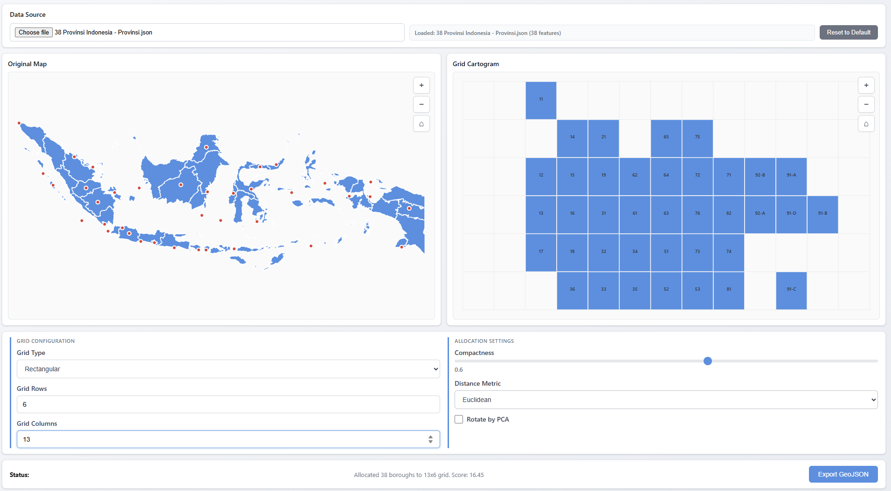

# GridMapper

[](https://www.npmjs.com/package/gridmapper) [](https://github.com/danylaksono/gridmapper/actions) [](LICENSE) [](https://github.com/danylaksono/gridmapper/stargazers)

A JavaScript library for allocating geographic points to a grid using Mixed Integer Programming (MIP). This library provides an optimized solution for spatial data visualization by mapping geographic coordinates to grid cells while preserving spatial relationships.



see the [demo](https://danylaksono.is-a.dev/gridmapper/demo/) for the interactive demo and usage example.

## Inspiration

This library is inspired by and builds upon the work of **Jo Wood's Grid Map Allocation** library ([@gridmap_allocation](https://observablehq.com/@jwolondon/gridmap-allocation)). The original implementation demonstrated the concept of using linear programming to allocate geographic points to grid cells. This library extends that work with small additional features and optimisations.

## Features

- **Simple API**: Easy-to-use allocation method
- **Advanced API**: Extended features including:
  - Auto-calculation of grid dimensions based on aspect ratio
  - Principal Component Analysis (PCA) rotation for better alignment
  - Support for hexagonal and rectangular grids
  - Adjacency constraints for compact clustering
  - Post-processing optimization with simulated annealing
- **Flexible MIP Solver**: Works with any MIP solver that implements the required interface (GLPK.js included)

## Installation

```bash
npm install gridmapper
```

## Quick Start

### Simple API (matching original library)

```javascript
import { GridMapper } from 'gridmapper';
import { GLPKSolver } from 'gridmapper/glpk-solver';
import glpk from 'glpk.js';

const glpkInstance = await glpk();
const mapper = new GridMapper();

const points = [
  [longitude1, latitude1],
  [longitude2, latitude2],
  // ... more points
];

const result = await mapper.allocateSimple(
  points,
  7,   // rows
  12,  // cols
  0.6, // compactness (0-1)
  [],  // spacers
  {
    mip: () => new GLPKSolver(glpkInstance)
  }
);

console.log(result.cells); // [[row, col], ...]
```

### Advanced API

```javascript
import { GridMapper } from 'gridmapper';
import { GLPKSolver } from 'gridmapper/glpk-solver';
import glpk from 'glpk.js';

const glpkInstance = await glpk();
const mapper = new GridMapper();

const data = [
  { name: 'Location A', lon: -74.0, lat: 40.7 },
  { name: 'Location B', lon: -73.9, lat: 40.8 },
  // ... more locations
];

const result = await mapper.allocate(data, {
  xAccessor: d => d.lon,
  yAccessor: d => d.lat,
  compactness: 0.6,
  rotateByPCA: true,  // Align grid to principal axis
  gridType: 'rect',    // or 'hex'
  mip: () => new GLPKSolver(glpkInstance)
  // rows and cols are auto-calculated if not provided
});

// Result includes gridX and gridY properties added to each data item
result.assignments.forEach(item => {
  console.log(`${item.name}: grid[${item.gridX}, ${item.gridY}]`);
});
```

## API Reference

### `GridMapper`

#### `allocateSimple(points, nRows, nCols, compactness, spacers, options)`

Simple allocation API matching the original Jo Wood library.

**Parameters:**
- `points` (Array): Array of `[x, y]` coordinates or objects with x/y accessors
- `nRows` (number): Number of grid rows
- `nCols` (number): Number of grid columns
- `compactness` (number): 0 to 1. 0.5 = relative geo position, 1 = center cluster
- `spacers` (Array): Optional array of `[row, col]` spacer positions
- `options` (Object): Optional configuration
  - `xAccessor` (Function): Accessor for x coordinate
  - `yAccessor` (Function): Accessor for y coordinate
  - `mip` (Function): Factory function returning MIP solver instance

**Returns:** `Promise<Object>` with `{ nRows, nCols, cells: [[row, col], ...] }`

#### `allocate(data, options)`

Advanced allocation API with extended features.

**Parameters:**
- `data` (Array): Array of data objects
- `options` (Object): Configuration options
  - `xAccessor` (Function): Accessor for longitude/X coordinate
  - `yAccessor` (Function): Accessor for latitude/Y coordinate
  - `rows` (number): Optional number of grid rows (auto-calculated if not provided)
  - `cols` (number): Optional number of grid columns (auto-calculated if not provided)
  - `compactness` (number): 0 to 1, default 0.5
  - `mip` (Function): Factory function returning MIP solver instance (required)
  - `rotateByPCA` (boolean): Align grid to principal axis
  - `gridType` (string): 'rect' | 'hex' | 'ragged'
  - `distanceMetric` (string): 'euclidean' | 'manhattan'
  - `spacers` (Array): Array of `[row, col]` spacer positions
  - `mask` (Object): GeoJSON polygon for auto-computing spacers
  - `adjacencyWeight` (number): Weight for adjacency constraints
  - `runSA` (boolean): Run simulated annealing post-processing
  - And more...

**Returns:** `Promise<Object>` with `{ assignments: [...], meta: {...} }`

## Utility Functions

### GeoJSON Export

The library provides utilities to export grid cartograms as GeoJSON for use in mapping libraries or GIS tools:

```javascript
import { createGridGeoJson, createPointsGeoJson } from 'gridmapper';

// After allocation
const result = await mapper.allocate(data, options);

// Create GeoJSON for grid polygons (supports both 'rect' and 'hex' grid types)
// You can pass gridType directly or pass result.meta for convenience
const gridGeoJson = createGridGeoJson(
  result.assignments,
  result.meta.bounds,
  result.meta  // Automatically uses gridType from meta
);
// Or specify explicitly:
// const gridGeoJson = createGridGeoJson(result.assignments, result.meta.bounds, 'hex');

// Create GeoJSON for input points
const pointsGeoJson = createPointsGeoJson(data);

// Export to file or use with mapping libraries
console.log(JSON.stringify(gridGeoJson, null, 2));
```

**`createGridGeoJson(assignments, bounds, gridType)`**
- `assignments`: Array of assignment objects from `allocate()` result
- `bounds`: Bounds object from `result.meta.bounds`
- `gridType`: `'rect'` (default) or `'hex'` - determines polygon shape
- Returns: GeoJSON FeatureCollection with grid polygons

**`createPointsGeoJson(data)`**
- `data`: Array of data objects with `lon`, `lat`, and `name` properties
- Returns: GeoJSON FeatureCollection with point features

### Parameter Estimation

The library provides utilities to automatically estimate optimal parameters for grid allocation:

```javascript
import { estimateParameters, estimateParametersFromData } from 'gridmapper';

// Estimate from GeoJSON data
const geojson = {
  type: 'FeatureCollection',
  features: [
    { type: 'Feature', geometry: { type: 'Point', coordinates: [-74.0, 40.7] } },
    // ... more features
  ]
};

const estimatedParams = estimateParameters(geojson, {
  xAccessor: d => d.lon,
  yAccessor: d => d.lat
});

// Use estimated parameters
const result = await mapper.allocate(data, {
  ...estimatedParams,
  mip: () => new GLPKSolver(glpkInstance)
});

// Or estimate from processed data points
const data = [
  { name: 'Location A', lon: -74.0, lat: 40.7 },
  // ... more locations
];

const params = estimateParametersFromData(data, {
  xAccessor: d => d.lon,
  yAccessor: d => d.lat
});
```

**`estimateParameters(geojson, options)`**
- `geojson`: GeoJSON FeatureCollection with Point, Polygon, or MultiPolygon features
- `options`: Configuration object
  - `xAccessor` (Function): Accessor for longitude/x coordinate (default: `d => d.lon`)
  - `yAccessor` (Function): Accessor for latitude/y coordinate (default: `d => d.lat`)
- Returns: Object with `{ rows, cols, compactness, rotateByPCA }`

**`estimateParametersFromData(data, options)`**
- `data`: Array of data objects with x/y coordinates
- `options`: Configuration object
  - `xAccessor` (Function): Accessor for x coordinate (default: `d => d.x`)
  - `yAccessor` (Function): Accessor for y coordinate (default: `d => d.y`)
- Returns: Object with `{ rows, cols, compactness, rotateByPCA }`

## Examples

See the `examples/` directory for complete working examples:
- `example.js` - Advanced API usage
- `example_simple.js` - Simple API usage
- `index.html` - Interactive browser-based visualization

## Project Structure

The library is organized into clear modules following best practices:

```
src/
  ├── index.js                    # Main entry point, re-exports
  │
  ├── core/                       # Core allocation logic
  │   ├── grid-mapper.js          # Main GridMapper class (orchestrator)
  │   ├── allocation-engine-simple.js    # Simple MIP allocation
  │   └── allocation-engine-advanced.js  # Advanced MIP allocation
  │
  ├── grid/                       # Grid utilities
  │   └── grid-factory.js         # Grid creation and manipulation
  │
  ├── normalization/              # Point transformation
  │   ├── point-normalizer.js     # Point normalization logic
  │   └── bounds-calculator.js    # Bounds calculation
  │
  ├── features/                   # Advanced features
  │   ├── pca-rotation.js         # PCA rotation utilities
  │   ├── spacer-utils.js         # Spacer computation
  │   └── auto-dimensions.js      # Auto grid dimension calculation
  │
  ├── post-processing/            # Optimization algorithms
  │   └── optimizer.js            # Greedy swaps + simulated annealing
  │
  ├── solvers/                    # MIP solver adapters
  │   └── glpk-solver.js          # GLPK solver adapter
  │
  └── utils/                      # Output utilities
      ├── geojson-utils.js        # GeoJSON output formatting
      └── parameter-estimator.js  # Parameter estimation utilities
```

### Module Organization

- **Core**: Main allocation engines and GridMapper orchestrator class
- **Grid**: Grid creation, manipulation, and cell utilities
- **Normalization**: Point transformation and bounds calculation
- **Features**: Advanced features like PCA rotation, spacer computation, and auto-dimensions
- **Post-processing**: Optimization algorithms (greedy swaps, simulated annealing)
- **Solvers**: MIP solver adapters (currently GLPK)
- **Utils**: Output formatting utilities (GeoJSON) and parameter estimation

This structure provides:
- **Clear separation of concerns**: Each module has a single, well-defined responsibility
- **Easy maintenance**: Changes are localized to specific modules
- **Better testability**: Components can be tested in isolation
- **Improved reusability**: Modules can be imported independently
- **Easier onboarding**: New contributors can quickly understand the codebase

## Building

```bash
npm install
npm run build
```

This will create bundled versions in the `dist/` directory:
- `dist/gridmapper.umd.js` - Browser build (UMD)
- `dist/gridmapper.esm.js` - ES module build
- `dist/gridmapper.cjs.js` - CommonJS build

## Development

The library uses:
- **Rollup** for bundling
- **ES modules** for source code
- **Kebab-case** naming convention for files
- **Modular architecture** for maintainability

For development with watch mode:
```bash
npm run dev
```

## CI Publishing (Draft releases)

- Add an npm Automation token to your repository secrets as `NPM_TOKEN` (set an expiry and package/CIDR restrictions where possible).
- Create a Draft release in GitHub (you may supply a `vX.Y.Z` tag name or leave it blank).
- On draft creation the workflow `.github/workflows/draft-release-publish.yml` will bump or set the `package.json` version, commit and tag, build, publish to npm, and mark the GitHub release as published.

Notes:
- The workflow requires the `NPM_TOKEN` secret and `GITHUB_TOKEN` (provided by Actions). Use an Automation token (least privilege) and rotate regularly.

Automatic changelog & versioning

- The repository is configured to use [Release Please](https://github.com/google-github-actions/release-please-action) to generate CHANGELOG entries and bump versions following conventional commits.
- On a push to `main`, Release Please will open a release PR or create a release (depending on configuration) that includes changelog and `package.json` version changes. Merge that PR (or accept the created release) to trigger the publish workflow.
- If you prefer releases to be drafts, you can set `create-release: true` and `draft: true` in `.github/workflows/release-please.yml` inputs.
## License

This project is licensed under the ISC License — see the [LICENSE](LICENSE) file for details.

## Acknowledgments

- Original concept and inspiration: [Jo Wood's Grid Map Allocation](https://observablehq.com/@jwolondon/gridmap-allocation)
- Tom Larkworthy's [Mixed Integer/Linear Programming Solver](https://observablehq.com/@tomlarkworthy/mip) 
- MIP Solver: [GLPK.js](https://github.com/jvail/glpk.js)

© 2025 danylaksono